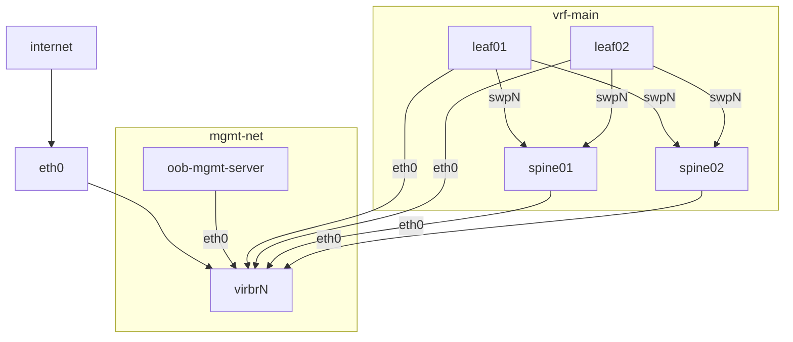

# libvirt-network-topology

Some shell scripts to create a basic 2 leaf 2 spine topology from Debian Cloud machines.




### USAGE

Create topology

```
./create.sh
# wait a few seconds...
ssh debian@172.31.255.2
# view bgp routes
debian@leaf01:~$ sudo vtysh -c 'show bgp vrf vrf-main ipv4 unicast'
BGP table version is 4, local router ID is 10.1.1.1, vrf id 5
Default local pref 100, local AS 65501
Status codes:  s suppressed, d damped, h history, * valid, > best, = multipath,
               i internal, r RIB-failure, S Stale, R Removed
Nexthop codes: @NNN nexthop's vrf id, < announce-nh-self
Origin codes:  i - IGP, e - EGP, ? - incomplete
RPKI validation codes: V valid, I invalid, N Not found

   Network          Next Hop            Metric LocPrf Weight Path
*> 10.1.1.1/32      0.0.0.0(leaf01)          0         32768 ?
*= 10.1.1.2/32      swp2                                   0 65500 65502 ?
*>                  swp1                                   0 65500 65502 ?
*> 10.1.1.3/32      swp1                     0             0 65500 ?
*> 10.1.1.4/32      swp2                     0             0 65500 ?

Displayed  4 routes and 5 total paths

# verify connectivity between leaf01 & leaf02
debian@leaf01:~$ sudo ip vrf exec vrf-main ping -c1 10.1.1.2
PING 10.1.1.2 (10.1.1.2) 56(84) bytes of data.
64 bytes from 10.1.1.2: icmp_seq=1 ttl=63 time=1.02 ms

--- 10.1.1.2 ping statistics ---
1 packets transmitted, 1 received, 0% packet loss, time 0ms
rtt min/avg/max/mdev = 1.017/1.017/1.017/0.000 ms

```

Destroy topology

```
./destroy.sh
```
